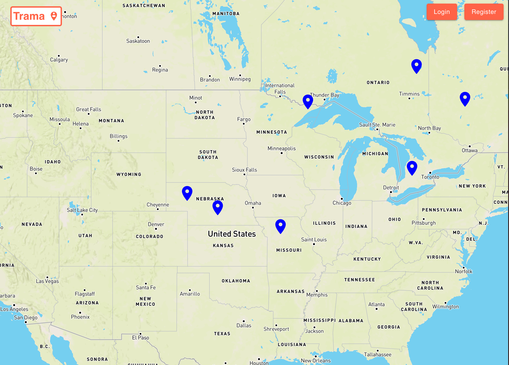
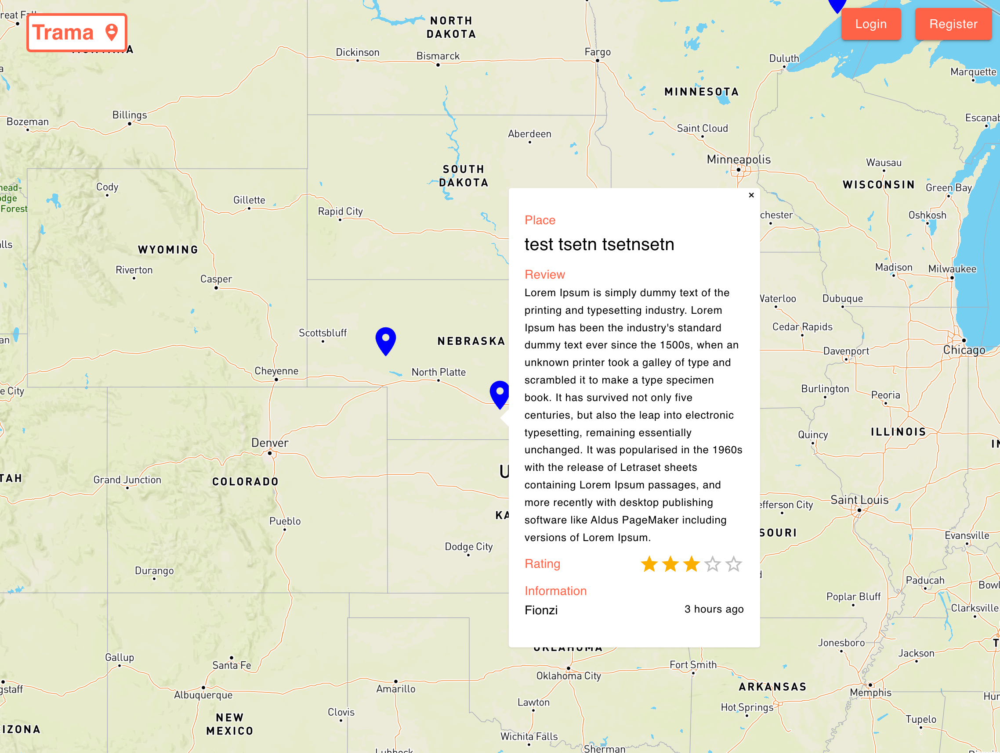
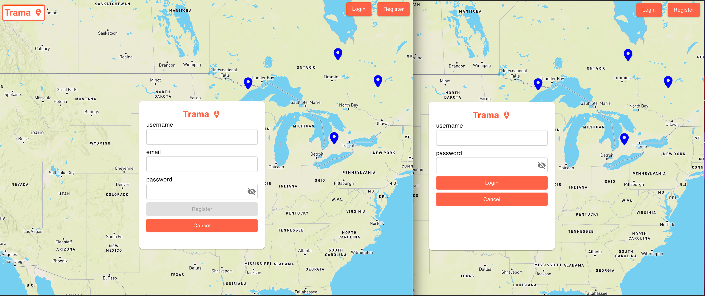
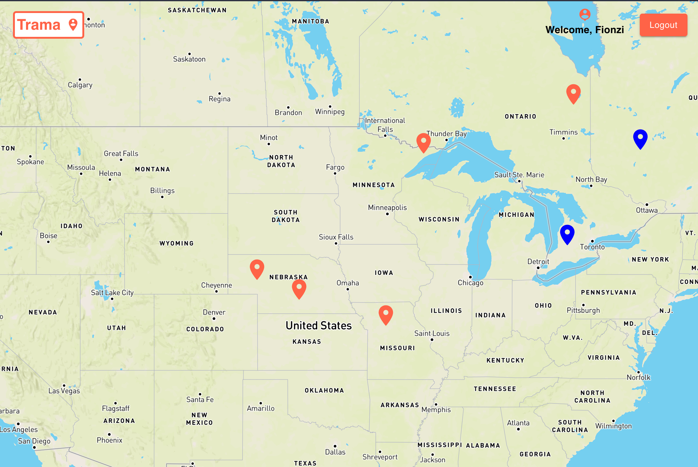
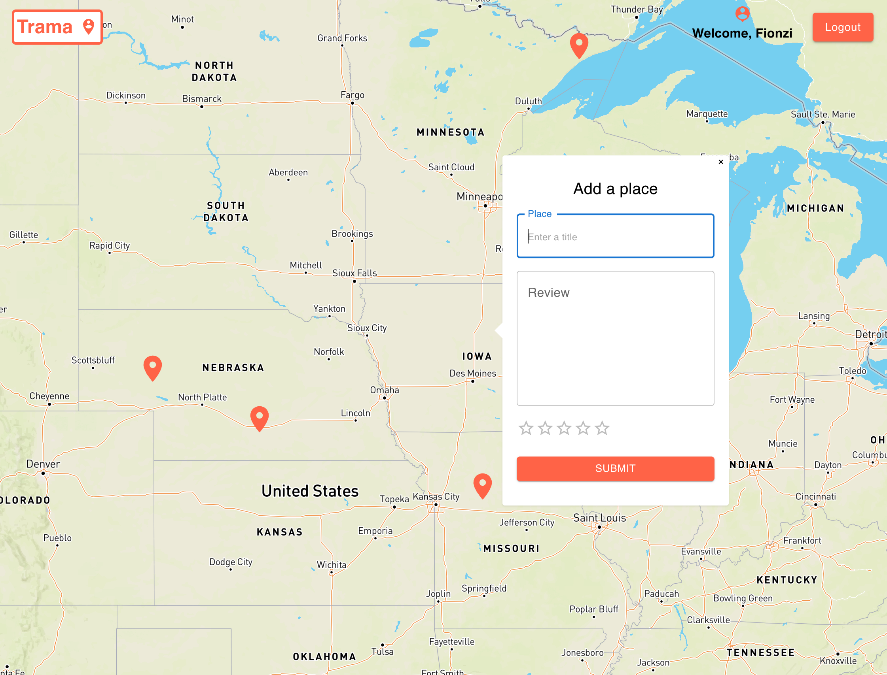
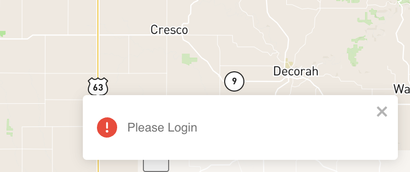
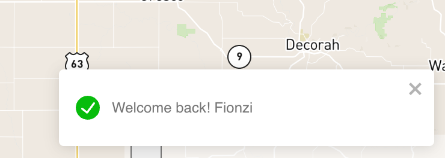
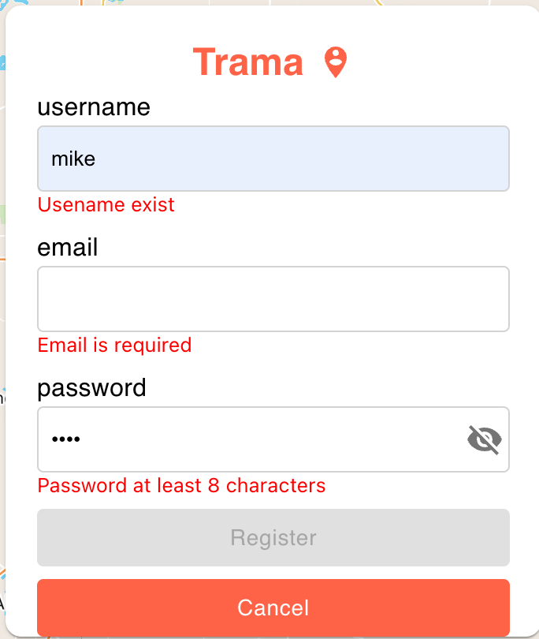

# Tramma Map application

### Libraries Used

##### Frontend
- React
- MaterialUI
- React Router
- Axios
- Rxjs for state management

##### Backend
- Express
- REST API
- MongoDB
- Mongoose

### Features

- Home page

- view pin

- Login & Register

- User view

- Add pin

- Notification

- Form validation

